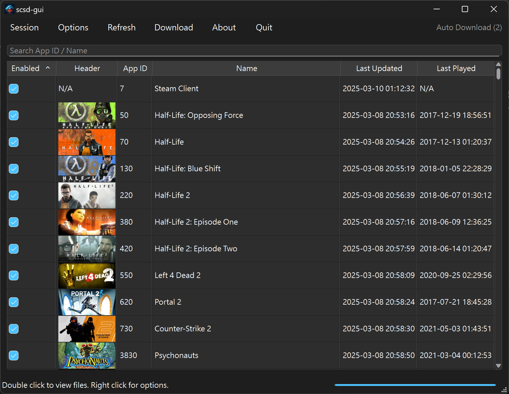
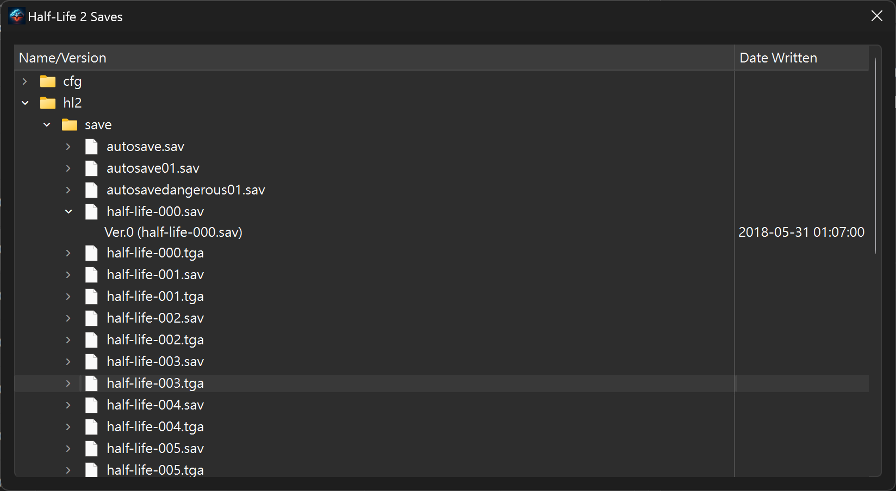

<p align="center">

</p>

steamCloudSaveDownloaderGUI
===========
[](LICENSE)[]

Download/Backup Saves on Steam Cloud Automatically. An official frontend implementation to [scsd](https://github.com/pyscsd/steamCloudSaveDownloader) in Python/Qt

> [!WARNING]
> This program is in alpha stage. Expect bugs and breaking changes. Use at your own risk.

#### [📄Documentation]() | [⏬Download](https://github.com/pyscsd/steamCloudSaveDownloaderGUI/releases)

## :warning: DISCLAIMER
- This program is not affiliated with Valve or Steam. Steam is a trademark of Valve Corporation.
- This program does not come with warranty and use at your own risk. Even though this program is thoroughly tested and theoretically does not violate EULA.

## Screenshots
<p float="left">
    
    
</p>

## Features
- Easy to setup (in less than one minute)
- Secure
- Periodically download in background
- Intuitive interface

## How to build
```
pip install -r requirements-dev.txt
python3 scsd-gui
```